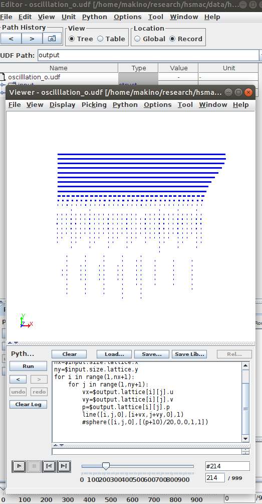

# hsmac

2次元および3次元のhsmac法のプログラムです。
[OCTA](http://octa.jp/)のインターフェースであるGOURMETで動きます。
GOURMETのメニューから、 Tool>Environments Setup から、ダウンロードしたディレクトリを指定して使ってください。

実行ファイルは、Ubuntu18.04.5でコンパイルしています。 
２次元の場合は
hsmac2d -I inputfile -O outputfile
３次元の場合は
hsmac3d -I inputfile -O outputfile
で実行してください。
たとえば、 hsmac2d -I channel.udf -O channel_o.udf のようにです。

-------------

